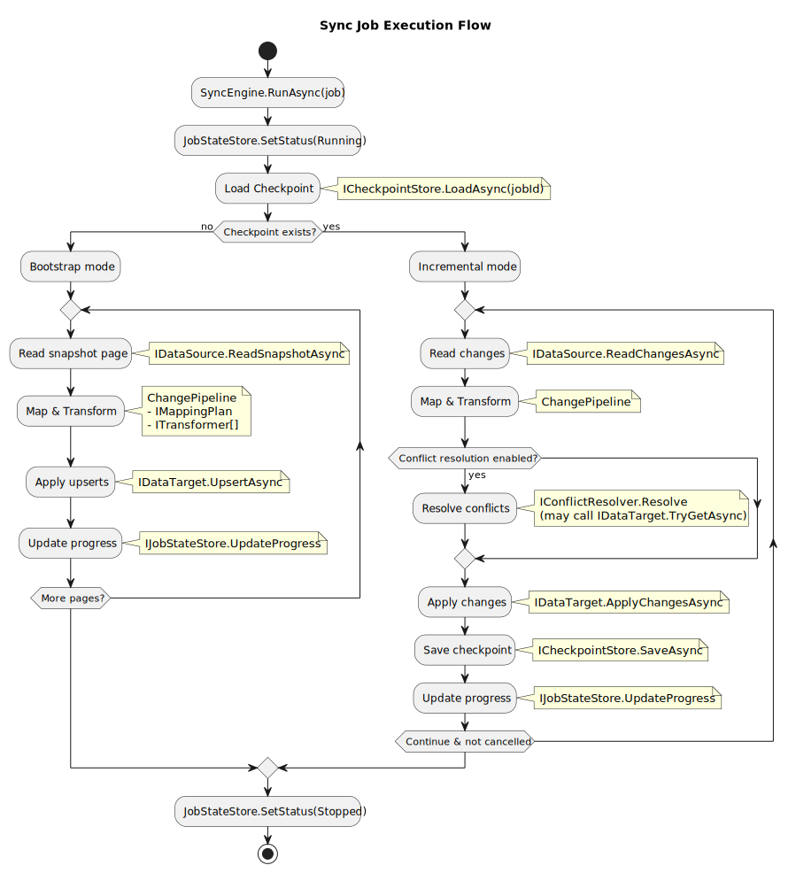

# idou

`移動　(idō)` means migration in Japanese.

This project aims to provide syncing between different databases.

You can follow the progress on the [roadmap](https://github.com/orgs/kougen/projects/4/views/1).

> [!NOTE]
> At first the project will only support DynamoDB <-> PostgreSQL.
> There are plans to support other databases in the future.

## Development

The current architecture plan is as follows.

And the basic flow is as follows.

> [!NOTE]
> There are plans to create an API and a client application in the future.
> This way you can schedule and monitor parallel migrations through the API.