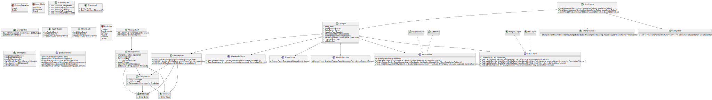

# idou

`移動　(idō)` means migration in Japanese.

This project aims to provide syncing between different databases.

> ![NOTE]
> At first the project will only support DynamoDB <-> PostgreSQL.
> There are plans to support other databases in the future.

## Development

The current architecture plan is as follows.

